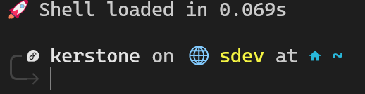

# Dotfiles

Personal configuration files for a Zsh-based development environment.



The image shows the startup time reported by `.zshrc`. Zsh records the time spent loading the configuration and prints the result when the shell is ready. The configuration also compiles unchanged Zsh modules and reloads aliases when the alias file changes.

## Overview

This repository centralizes shell configuration, command aliases, terminal tools, editor settings, and installation helpers. The configuration is designed to be shared between machines while keeping machine-specific values in environment variables such as `HOME`.

## Repository layout

```text
.
├── .config/
│   ├── atuin/              Atuin history configuration
│   ├── herdr/              Herdr terminal configuration
│   ├── keg/                Keg package manager configuration
│   ├── nvim/               Neovim and LazyVim configuration
│   ├── zellij/             Zellij configuration and layouts
│   └── starship.toml       Starship prompt configuration
├── install/
│   ├── keg.yml             Package manifest for Keg
│   └── symlinks.sh         Create links for managed configuration files
├── zsh/
│   ├── zsh_aliases         Shell aliases and helper functions
│   ├── zsh_brew            Homebrew integration
│   ├── zsh_custom_config   PATH and tool configuration
│   ├── zsh_env             Environment variables
│   ├── zsh_fzf             fzf integration
│   ├── zsh_git_func        Git and development functions
│   ├── zsh_keys             Keyboard bindings
│   └── zsh_tools            Zsh plugins and command integrations
├── .zshrc                  Main Zsh entry point
└── img/boot.png            Zsh startup time screenshot
```

## Installation

### Requirements

- Git
- Zsh
- A working Homebrew installation for optional plugin integrations
- Keg for package installation, if package installation is desired

Clone the repository and enter its directory:

```bash
git clone https://github.com/kerstone/dotfiles.git ~/dotfiles
cd ~/dotfiles
```

Create the configuration links:

```bash
./install/symlinks.sh
```

To preserve existing files before replacing them with links, use the backup option:

```bash
BACKUP_EXISTING=true ./install/symlinks.sh -b
```

Install the packages listed in `install/keg.yml` with Keg if it is available:

```bash
keg install
```

> To install Keg you can go to the [repository](https://github.com/kerstone/keg.git) and follow the procedure.

Start a new Zsh session after installation:

```bash
exec zsh
```

## Shell configuration

The root `.zshrc` loads the modules in `zsh/` and provides:

- Zsh module compilation with `.zwc` cache files
- Automatic alias reloads when `zsh/zsh_aliases` changes
- Starship prompt integration
- Atuin history search when Atuin is installed
- zoxide, fzf, Zsh autosuggestions, and syntax highlighting
- Git, Docker, Terraform, Ansible, Fedora, and system utility aliases
- Optional integrations for Go, GitHub CLI, Herdr, Zellij, Yubikey tools, and RDAP

The generated cache files and alias state are ignored by Git.

## Neovim

The Neovim configuration is based on LazyVim and includes configuration for:

- LSP and language tooling
- Formatting and linting
- Blink completion
- Treesitter
- Bufferline
- CodeDiff
- OSC 52 clipboard support
- YAML editing
- The `ao` colorscheme

The plugin lock file is intentionally kept outside the tracked repository state.

## Zellij

The Zellij configuration uses `Ctrl+B` as its leader key and provides:

- Persistent pane focus mode with `h`, `j`, `k`, and `l`
- Persistent resize mode with `h`, `j`, `k`, and `l`
- Pane splitting commands
- Tab navigation commands
- A `code` layout with one large pane and two smaller vertical panes

Press `Esc` to leave the active Zellij mode.

## Security and local data

This repository contains configuration files only. Authentication tokens, private keys, shell history, generated logs, compiled binaries, and machine-specific cache files should remain outside the repository.

Review the configuration before installing it on another machine, especially the shell aliases.

## Customization

Use environment variables to override paths when needed:

```bash
export DOTFILES_DIR="$HOME/dotfiles"
export EDITOR="nvim"
```

Add shell aliases and functions to the appropriate file under `zsh/`. Add application-specific configuration under `.config/`.

## License

MIT License. Feel free to use and modify these files.
